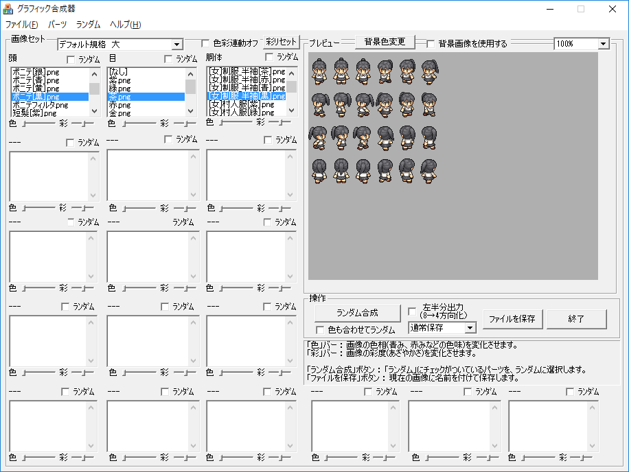
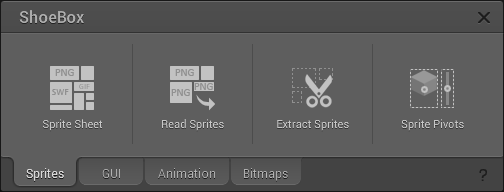
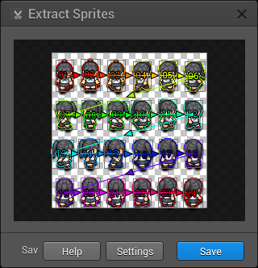
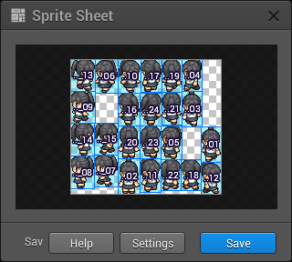
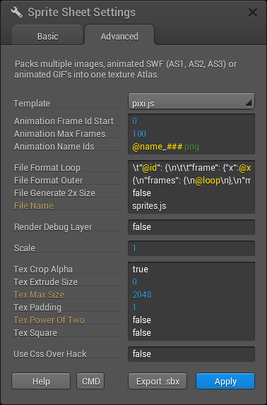
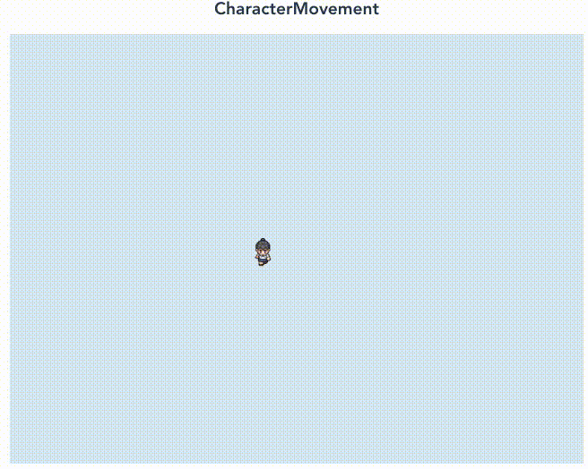
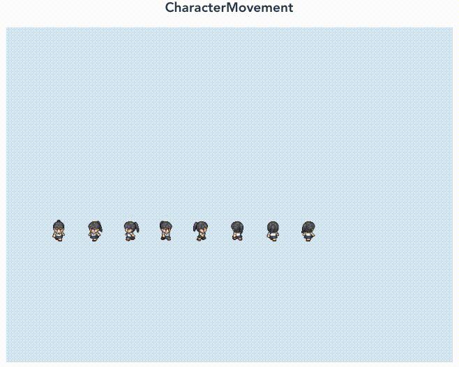
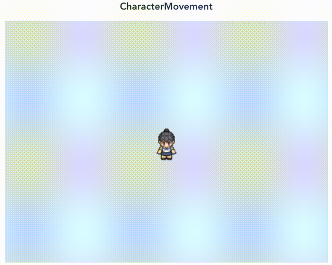

# お勉強ノート

Vue.js上でpixi.jsを用いたゲーム作りをするべく、プロジェクトを作成するところから順を追って説明する。

<!-- TOC depthFrom:2 -->

- [プロジェクト準備](#プロジェクト準備)
    - [vue-cliのインストール](#vue-cliのインストール)
    - [プロジェクトを作成する](#プロジェクトを作成する)
    - [pixi.jsインストール](#pixijsインストール)
- [はじめてのVue.js](#はじめてのvuejs)
    - [HelloPixi](#hellopixi)
- [はじめてのPixi.js](#はじめてのpixijs)
    - [不要なコードを削除する](#不要なコードを削除する)
    - [import](#import)
    - [logo.pngを表示して回転させてみる](#logopngを表示して回転させてみる)
    - [文字を表示させてみる](#文字を表示させてみる)
- [buildする](#buildする)
    - [build](#build)
    - [build資材を動かしてみる](#build資材を動かしてみる)
- [キー入力でロゴを動かす](#キー入力でロゴを動かす)
    - [キーボード入力を受け付ける](#キーボード入力を受け付ける)
    - [Unexpected console statementの表示を止める](#unexpected-console-statementの表示を止める)
    - [キーボード入力状態変数](#キーボード入力状態変数)
    - [ゲームループを実装する](#ゲームループを実装する)
    - [速度計算とロゴ移動](#速度計算とロゴ移動)
- [キャラクターアニメーション](#キャラクターアニメーション)
    - [キャラクター画像生成](#キャラクター画像生成)
    - [Texture Atrasデータ作成](#texture-atrasデータ作成)
    - [(おまけ)Texture Atrasデータ作成 もう一つのやり方](#おまけtexture-atrasデータ作成-もう一つのやり方)
    - [Texture Atras形式で画像読み込み](#texture-atras形式で画像読み込み)
    - [AnimatedSpriteでキャラクターアニメーション](#animatedspriteでキャラクターアニメーション)
- [キャラクターを歩かせてみる](#キャラクターを歩かせてみる)
    - [セーラー少女を動かしてみる](#セーラー少女を動かしてみる)
    - [方向概念の導入](#方向概念の導入)
    - [8方向のAnimatedSpriteを作成する](#8方向のanimatedspriteを作成する)
    - [SpriteをまとめるContainer](#spriteをまとめるcontainer)
    - [セーラー少女を歩かせる](#セーラー少女を歩かせる)

<!-- /TOC -->

## プロジェクト準備

参考：[Vue.js を vue-cli を使ってシンプルにはじめてみる](https://qiita.com/567000/items/dde495d6a8ad1c25fa43)

### vue-cliのインストール

``` bash
npm install -g @vue/cli
```

### プロジェクトを作成する

``` bash
vue create pixi-practice
> default

cd pixi-practice
npm run serve
```

ブラウザで <http://localhost:8080/> にアクセスするとサンプルが表示されるはずなので確認しておく。

### pixi.jsインストール

``` bash
npm install pixi.js
```

## はじめてのVue.js

Vue.jsのファイル構成がわかるようにファイルを変更していく。

関連ファイルを保存すると <http://localhost:8080/> が更新されるはずなので、ファイルの一文言を変更するたびにファイルを保存して動作を確認すると理解が早い。

### HelloPixi

App.vueのtemplateを下記のように書き換えて保存し、ロゴが消え、文言が変わることを確認する。

``` vue:App.vue
<template>
  <div id="app">
    <HelloWorld msg="Welcome to Your Pixi.js App"/>
  </div>
</template>
```

templateとscriptのHelloWorldをHelloPixiに書き換える。

``` vue:App.vue
<template>
  <div id="app">
    <HelloPixi msg="Welcome to Your Pixi.js App"/>
  </div>
</template>

<script>
import HelloPixi from './components/HelloWorld.vue'

export default {
  name: 'app',
  components: {
    HelloPixi
  }
}
</script>
```

scriptのHelloWorld.vueをHelloPixi.vueに書き換え、ブラウザエラーもしくは何も表示されなくなることを確認する。

``` vue:App.vue
<script>
import HelloPixi from './components/HelloPixi.vue'
```

ファイル名HelloWorld.vueをHelloPixi.vueに書き換えるとブラウザ表示されるはず。

念の為HelloPixi.vueの下記Script部分もHelloWorldをHelloPixiに書き換える。

``` vue:HelloPixi.vue
<script>
export default {
  name: 'HelloPixi',
  props: {
    msg: String
  }
}
</script>
```

## はじめてのPixi.js

- 参考
  - [Pixi.jsでCanvasをカンタンに触ってみよう！](https://liginc.co.jp/398188)
  - [Pixi.js でゲームを作ってみる vol.1](https://ryo620.org/2016/12/pixijs-game-01/)

### 不要なコードを削除する

HelloPixi.vueのtemplateとstyleを色々削除しておく。

``` vue:HelloPixi.vue
<template>
  <div class="hello">
    <div class="stage" id="stage"></div>
  </div>
</template>

<!-- Add "scoped" attribute to limit CSS to this component only -->
<style scoped>
</style>
```

### import

HelloPixi.vueのscriptの冒頭に下記を記載する。

1行目でpixi.js読み込みで、2行目は今回のサンプルで利用するlogo.pngを利用する準備。これらのファイルを利用することをvue-cliに教えておくおことで、vue-cliでバンドルする際にパス関連等をうまく調整してくれる。

``` vue:HelloPixi.vue
<script>
import * as PIXI from 'pixi.js';
import AssetsImageLogo from "@/assets/logo.png";
```

参考：[Vue.jsでの画像指定方法を間違ってたので、振り返る](https://qiita.com/skmtko/items/a83f836b48f24309916d)

### logo.pngを表示して回転させてみる

HelloPixi.vueのscriptの`export default`の部分を書き換えて、Vue.jsのロゴを回転させてみる。

``` javascript
export default {
  name: 'HelloPixi',
  props: {
    msg: String
  },
  mounted () {
    // 表示するcanvasを用意
    let app = new PIXI.Application(800, 600, {backgroundColor : 0xDAE8F4});
    document.getElementById('stage').appendChild(app.view);

    //------画像のアニメーション-----//

    // イメージを指定
    let logo = PIXI.Sprite.fromImage(AssetsImageLogo);

    // 画像のアンカーポイントの指定
    logo.anchor.set(0.5);

    // 画像を画面中央に移動
    logo.x = app.screen.width / 2;
    logo.y = app.screen.height / 2.5;

    // ステージに表示させる
    app.stage.addChild(logo);

    // アニメーションの再生、ループ
    app.ticker.add(function(delta) {
        // 画像を回転
        logo.rotation += 0.05 * delta;
    });
  }
}
```

### 文字を表示させてみる

さらにscript部分を書き換えて文字を表示させてみる。

``` javascript
    // アニメーションの再生、ループ
    app.ticker.add(function(delta) {
        // 画像を回転
        logo.rotation += 0.05 * delta;
    });

    //------テキストの描画-----//

    // スタイルを指定
    let styleBig = new PIXI.TextStyle({
        fontFamily: 'Avenir, Helvetica, Arial, sans-serif',
        fontSize: 70,
        align: 'center',
        wordWrapWidth: 1000,
        wordWrap: true
    });
    let styleSmall =  new PIXI.TextStyle({
        fontFamily: 'Avenir, Helvetica, Arial, sans-serif',
        fontSize: 40,
        align: 'center',
        wordWrapWidth: 1000,
        wordWrap: true
    });

    // スタイルを反映
    let textBig = new PIXI.Text('Vue.js', styleBig);
    textBig.anchor.set(0.5);

    let textSmall = new PIXI.Text('Hello, Pixi.js', styleSmall);
    textSmall.anchor.set(0.5);

    // テキストの位置を指定
    textBig.x = 400;
    textBig.y = 430;
    textSmall.x = 400;
    textSmall.y = 530;

    // ステージに表示させる
    app.stage.addChild(textBig);
    app.stage.addChild(textSmall);
  }
}
</script>
```

textSmall初期化部を下記のように`this.msg`を渡してみると、App.vueのtemplate内の`<HelloPixi msg="Welcome to Your Pixi.js App"/>`で渡した文字が表示できる。

``` vue:HelloPixi.vue
    let textSmall = new PIXI.Text(this.msg, styleSmall);
```

## buildする

### build

``` bash
npm run build
```

ファイルサイズがどうとかというWarningが出てくるかもしれないが、とりあえず動くのでここでは触れない。

デフォルトだとdistディレクトリにビルド結果のファイルを置かれているので確認してみる。

``` bash
ls -lt dist
```

### build資材を動かしてみる

お試し動作コマンドをインストールする。

``` bash
npm install -g serve
```

お試し動作させてみる。

``` bash
$ serve -s dist

   ┌──────────────────────────────────────────────────┐
   │                                                  │
   │   Serving!                                       │
   │                                                  │
   │   - Local:            http://localhost:5000      │
   │   - On Your Network:  http://192.168.X.X:5000    │
   │                                                  │
   │   Copied local address to clipboard!             │
   │                                                  │
   └──────────────────────────────────────────────────┘
```

ブラウザで <http://localhost:5000> にアクセスするとさっきと同じように動いているのが確認できるはず

## キー入力でロゴを動かす

PCゲーマーならお馴染みのWASDを使ったキーボード入力を実装してみる。

### キーボード入力を受け付ける

src/components/MoveLogo.vueを作成し、下記の通り入力する。

``` vue:MoveLogo.vue
<template>
  <canvas width="800" height="600"></canvas>
</template>

<script>
import * as PIXI from "pixi.js";
import AssetsImageLogo from "@/assets/logo.png";

export default {
  name: "MoveLogo",
  mounted() {
    //------画像のアニメーション-----//
    // 表示するcanvasを用意
    const app = new PIXI.Application({
      view: this.$el,
      backgroundColor : 0xDAE8F4
    });

    // イメージを指定
    let logo = PIXI.Sprite.fromImage(AssetsImageLogo);

    // 画像のアンカーポイントの指定
    logo.anchor.set(0.5);

    // 画像を画面中央に移動
    logo.x = app.screen.width / 2;
    logo.y = app.screen.height / 2;

    // ステージに表示させる
    app.stage.addChild(logo);
  }
}
</script>

<!-- Add "scoped" attribute to limit CSS to this component only -->
<style scoped>
</style>
```

- 参考
  - [Canvas の組み込み | 基礎から学ぶ Vue.js](https://cr-vue.mio3io.com/examples/canvas.html)
  - [Pixi.js v4で自前のcanvas使う](https://qiita.com/zuya/items/9d5071bba4d98e4d4a9f)

このままでは画面に表示されないので、App.vueのtemplateに下記のように書き加えるとVue.jsのロゴが表示される。

``` vue:App.vue
<template>
  <div id="app">
    <h2>HelloPixi</h2>
    <HelloPixi msg="Welcome to Your Pixi.js App"/>
    <h2>MoveLogo</h2>
    <MoveLogo />
  </div>
</template>
```

次に、MoveLogo.vueにキーボードリスナを登録し、キーボード入力をconsoleに表示してみる。

今回使ったのはkeydownイベントとkeyupイベントなので、キーボードを押したタイミングと話したタイミングでconsoleに対応するキー名が表示される。

``` javascript
    // ステージに表示させる
    app.stage.addChild(logo);

    // キーボードが押されたイベント
    document.addEventListener('keydown', handleKeyDown);
    document.addEventListener('keyup', handleKeyUp);
  }
}

function handleKeyDown(e){
  var key = e.key;
  console.log(key);
}

function handleKeyUp(e){
  var key = e.key;
  console.log(key);
}
</script>
```

### Unexpected console statementの表示を止める

上記のコード入力を保存したところでconsoleが未定義というeslintのエラーが出るが、問題なく動くので設定を変更しておく。

いろいろな設定方法があるみたいだけど、package.jsonに書いておくのがスマートそう。

``` json:package.json
    "rules": {
      "no-console": "off"
    },
```

保存した後にnpm run serveをCtrl+Cで停止したあともう一度実行するとエラーが出ないはず。

- 参考
  - [Step by Stepで始めるESLint](https://qiita.com/howdy39/items/6e2c75861bc5a14b2acf)
  - [Configuration Reference | Vue CLI](https://cli.vuejs.org/config/#eslint)

### キーボード入力状態変数

ゲームでキーの入力状態を利用するために、`keyPressed`変数を作成する。

``` javascript
let keyPressed = {};

function handleKeyDown(e){
  var key = e.key;
  keyPressed[key] = true;
  console.log(keyPressed);
}

function handleKeyUp(e){
  var key = e.key;
  keyPressed[key] = false;
  console.log(keyPressed);
}
</script>
```

keyPressedによってユーザがどのキーを押しているのかがわかり、複数キー同時押し状態にも対応できる。

### ゲームループを実装する

ゲームループを実装する。これでconsoleにgameloop中の変数が出力される。
ついでに、handleKeyのconsoleも削除しておく。

``` javascript
    // キーボードが押されたイベント
    document.addEventListener('keydown', handleKeyDown);
    document.addEventListener('keyup', handleKeyUp);

    // ゲームループを実装
    app.ticker.add(delta => gameloop(delta, logo));
  }
}


let keyPressed = {};

function handleKeyDown(e){
  var key = e.key;
  keyPressed[key] = true;
}

function handleKeyUp(e){
  var key = e.key;
  keyPressed[key] = false;
}

// ゲームループで動かす関数
function gameloop(delta, logo) {
  console.log(’delta:’ + delta);
  console.log(logo);
  console.log(keyPressed);
}
</script>
```

### 速度計算とロゴ移動

このgameloop function内でkeyPressedを利用して、logoの位置を移動できるように変更する。

``` javascript
// ゲームループで動かす関数
function gameloop(delta, logo) {
  // 速度初期化
  let vx = 0;
  let vy = 0;
  // 加速度定義
  const ACCELERATION = 3;

  // WASDのキー情報を確認して、速度を変更する。
  if (keyPressed['w']) {
    vy -= ACCELERATION;
  }
  if (keyPressed['a']) {
    vx -= ACCELERATION;
  }
  if (keyPressed['s']) {
    vy += ACCELERATION;
  }
  if (keyPressed['d']) {
    vx += ACCELERATION;
  }

  // delta(前回実行時からの時間)と算出した速度をかけあわせて
  // logoを移動させる。
  logo.x += vx * delta;
  logo.y += vy * delta;
}
</script>
```

## キャラクターアニメーション

主に、[Pixi.js でゲームを作ってみる vol.1](https://ryo620.org/2016/12/pixijs-game-01/)を参考にしてキャラクターを表示してアニメーションさせてみる。

### キャラクター画像生成

[WOLF RPGエディターのダウンロード](http://www.silversecond.com/WolfRPGEditor/Download.html)からグラフィック合成器をダウンロードして利用する。

Windowsしか対応していないので注意。。。

こんな感じでセーラー服少女を用意してみた。画像セットをデフォルト企画　大にしたのは、ある程度解像度が欲しかったから。



src/assets/sailor_girl.pngに画像データを保存する。

### Texture Atrasデータ作成

たんしおレモンさんのサイトの[Pixi.jsのスプライトjsonファイル生成ツール](http://www.tansio.net/mobile/twitter/00002/)を利用して作成したキャラクター画像からTexture Atras形式のデータを生成する。

まずsrc/assets/sailor_girl.pngをsrc/assets/sailor_girl_sprites_tansio.pngにコピーしておこう。

つぎにsrc/assets/sailor_girl_sprites_tansio.jsonをテキストファイルとして生成しておく。

[Pixi.jsのスプライトjsonファイル生成ツール](http://www.tansio.net/mobile/twitter/00002/)をブラウザで表示して、下記の通り入力してから生成ボタンを押す。

```form
ファイル名：sailor_girl_sprites_tansio.png
テクスチャ名：sailor_girl_@@
取り出しＸサイズ：32
取り出しＹサイズ：48
取り出し総数：24
画像Ｘサイズ：192
画像Ｙサイズ：192
パディング：0
```

下部フォームにjson情報が生成されるので、そのデータをsailor_girl_sprites_tansio.jsonに入力する。

### (おまけ)Texture Atrasデータ作成 もう一つのやり方

[ShoeBox](http://renderhjs.net/shoebox/)というツールを使い、作成したキャラクター画像からTexture Atras形式のデータを生成することもできる。

たんしおさんツールで作成した時と比べ、画像サイズが最小になって良かったりもするのだが、余白がすべて削り取られることにより、アニメーション位置がずれるので調整が必要になるので、アニメーションする場合は注意を要する。

まずインストール項目を読んで、インストールし、起動する。



先ほど保存したsailor_girl.pngをExtract Spritesにドラッグ&ドロップし、Saveを押す。




上記を実行するとsailor_girl_01~24.pngとsailor_girl.png.txtが作成されるので、これらのファイルを全て選択してSprite Sheetにドラッグ&ドロップする。

Settingsボタンを押し、Sprite Sheet Settings画面のTemplateでpixi.jsを選択し、Applyを押してからSaveを押すと、sprites.jsとsprites.pngが作成される。




pngファイルは見ての通り全ての画像を合体した一つのファイルになっていて、jsonファイルは個々の画像をpngファイルのどこにあるかなどをまとめた形になっている。

なので、順番や位置がぐちゃってるけど気にしない。

sprites.jsはsailor_girl_sprites_shoebox.jsonに、sprites.pngはsailor_girl_sprites_shoebox.pngに命名変更する。

jsonファイルの中にもファイル名が書かれているので、sailor_girl_sprites_shoebox.jsonのmeta情報も変更する。

``` json:sailor_girl_sprites_shoebox.json
  "meta": {
    "image": "sailor_girl_sprites_shoebox.png",
      "size": { "w": 172, "h": 152 },
    "scale": "1"
  }
```

sailor_girl_01~24.pngとsailor_girl.png.txtは不要になるので削除する。

### Texture Atras形式で画像読み込み

下記の通り、src/components/CharacterAnimation.vueを新しく作成する。

``` vue:CharacterAnimation.vue
<template>
  <canvas width="800" height="600"></canvas>
</template>

<script>
import * as PIXI from "pixi.js";
import GirlSpritesJson from "@/assets/sailor_girl_sprites_tansio.json";
import GirlSpritesPng from "@/assets/sailor_girl_sprites_tansio.png";

export default {
  name: "CharacterAnimation",
  methods: {
    /** Assetsデータ読み込み後の非同期処理 */
    onAssetsLoaded: function() {
      // 2.pngファイルを元にBaseTextureを生成する
      const baseTexture = PIXI.BaseTexture.fromImage(GirlSpritesPng);
      // 3.Spritesheetオブジェクトを生成開始する
      const spritesheet = new PIXI.Spritesheet(baseTexture, GirlSpritesJson);
      spritesheet.parse(this.onSpritesheetLoaded);
    },
    /** Spritesheet生成完了後の非同期処理 */
    onSpritesheetLoaded: function(textures) {
      // 4.テクスチャを取り出す
      let texture = textures["sailor_girl_01"];
      let girl = PIXI.Sprite.from(texture);
      girl.anchor.set(0.5);
      girl.x = this.app.view.width / 2;
      girl.y = this.app.view.height / 2;
      this.app.stage.addChild(girl);
    }
  },
  mounted: function() {
    this.app = new PIXI.Application({
      view: this.$el,
      backgroundColor : 0xDAE8F4
    });

    // npm run serve時のリロードで同名ファイル名読み込みエラーを防ぐ
    PIXI.loader.reset();

    // 1.pngファイルを読み込む
    const loader = PIXI.loader.add(GirlSpritesPng);
    loader.load(this.onAssetsLoaded);
  }
};
</script>

<!-- Add "scoped" attribute to limit CSS to this component only -->
<style scoped>
</style>
```

App.vueに作成したCharacterAnimationを記述して画面表示してみよう。

``` vue:App.vue
<template>
  <div id="app">
    <h2>HelloPixi</h2>
    <HelloPixi msg="Welcome to Your Pixi.js App"/>
    <h2>MoveLogo</h2>
    <MoveLogo />
    <h2>CharacterAnimation</h2>
    <CharacterAnimation />
  </div>
</template>

<script>
import HelloPixi from './components/HelloPixi.vue'
import MoveLogo from './components/MoveLogo.vue'
import CharacterAnimation from './components/CharacterAnimation.vue'

export default {
  name: 'app',
  components: {
    HelloPixi,
    MoveLogo,
    CharacterAnimation
  }
}
</script>
```

- 参考
  - [Refactors the spritesheet, texture and bitmap font loaders by bigtimebuddy · Pull Request #3676 · pixijs/pixi.js](https://github.com/pixijs/pixi.js/pull/3676)
  - [Reloading a spritesheet · Issue #2419 · pixijs/pixi.js](https://github.com/pixijs/pixi.js/issues/2419)
  
### AnimatedSpriteでキャラクターアニメーション

onSpritesheetLoadedに下記の通りコードを追記して歩くセーラー服少女を表示してみよう。

``` javascript
    onSpritesheetLoaded: function(textures) {
      // 4.テクスチャを取り出す
      let texture = textures["sailor_girl_01"];
      let girl = PIXI.Sprite.from(texture);
      girl.anchor.set(0.5);
      girl.x = this.app.view.width / 2;
      girl.y = this.app.view.height / 2;
      this.app.stage.addChild(girl);

      // 5.アニメーション
      let downTextures = [
        textures["sailor_girl_01"],
        textures["sailor_girl_03"]
      ];
      let walk_girl = new PIXI.extras.AnimatedSprite(downTextures);
      walk_girl.anchor.set(0.5);
      walk_girl.x = this.app.view.width / 2 + 64;
      walk_girl.y = this.app.view.height / 2;
      walk_girl.animationSpeed = 0.05;
      walk_girl.play();
      this.app.stage.addChild(walk_girl);
    }
  },
```

## キャラクターを歩かせてみる

### セーラー少女を動かしてみる

まずは[キー入力でロゴを動かす](#キー入力でロゴを動かす)と[キャラクターアニメーション](#キャラクターアニメーション)を組み合わせてアニメーションさせたセーラー少女を動かしてみよう。

例のごとくCharacterMovement.vueを新しく作成する。一部だけ示すとこんな感じになるだろう。

``` javascript
    /** Spritesheet生成完了後の非同期処理 */
    onSpritesheetLoaded: function(textures) {
      let downTextures = [
        textures["sailor_girl_01"],
        textures["sailor_girl_00"],
        textures["sailor_girl_01"],
        textures["sailor_girl_02"]
      ];
      this.walk_girl = new PIXI.extras.AnimatedSprite(downTextures);
      this.walk_girl.anchor.set(0.5);
      this.walk_girl.x = this.app.view.width / 2 + 64;
      this.walk_girl.y = this.app.view.height / 2;
      this.walk_girl.animationSpeed = 0.05;
      this.walk_girl.play();
      this.app.stage.addChild(this.walk_girl);

      // キーボードが押されたイベント
      this.keyPressed = {};
      document.addEventListener("keydown", this.handleKeyDown);
      document.addEventListener("keyup", this.handleKeyUp);

      // ゲームループを実装
      this.app.ticker.add(delta => this.gameloop(delta));
    },
    /** キーダウン時処理 */
    handleKeyDown: function(e) {
      var key = e.key;
      this.keyPressed[key] = true;
    },
    /** キーアップ時処理 */
    handleKeyUp: function(e) {
      var key = e.key;
      this.keyPressed[key] = false;
    },
    /** ゲームループ本体 */
    gameloop: function(delta) {
      // 速度初期化
      let vx = 0;
      let vy = 0;
      // 加速度定義
      const ACCELERATION = 3;

      // WASDのキー情報を確認して、速度を変更する。
      if (this.keyPressed["w"]) {
        vy -= ACCELERATION;
      }
      if (this.keyPressed["a"]) {
        vx -= ACCELERATION;
      }
      if (this.keyPressed["s"]) {
        vy += ACCELERATION;
      }
      if (this.keyPressed["d"]) {
        vx += ACCELERATION;
      }

      // delta(前回実行時からの時間)と算出した速度をかけあわせて
      // this.walk_girlを移動させる。
      this.walk_girl.x += vx * delta;
      this.walk_girl.y += vy * delta;
    }
  },
```

これまで同様にApp.vueに要素を追加するとこんな感じでWASDで動くセーラー少女が表示されるはずだ。



これだと横滑りしているだけで味気ないので、方向の概念を取り入れよう。

### 方向概念の導入

下記のコードを書き加えるとconsoleに移動方向に応じた方向が表示されるはずだ。

``` javascript
      // delta(前回実行時からの時間)と算出した速度をかけあわせて
      // this.walk_girlを移動させる。
      this.walk_girl.x += vx * delta;
      this.walk_girl.y += vy * delta;

      // 方向を計算する。
      let direction = this.getDirection(vx, vy);
      console.log(" dir:" + direction);
    },
    /** 方向計算用メソッド */
    getDirection: function(vx, vy) {
      if( vx === undefined || vy === undefined ) {
        return undefined;
      }
      if( vx === 0 && vy === 0 ) {
        return undefined;
      }

      let rad = Math.atan2(vy, vx);

      if (rad <= - 7/8 * Math.PI || rad >= + 7/8 * Math.PI) {
        return "left";
      }
      if (rad >= - 7/8 * Math.PI && rad <= - 5/8 * Math.PI) {
        return "upleft";
      }
      if (rad >= - 5/8 * Math.PI && rad <= - 3/8 * Math.PI) {
        return "up";
      }
      if (rad >= - 3/8 * Math.PI && rad <= - 1/8 * Math.PI) {
        return "upright";
      }
      if (rad >= - 1/8 * Math.PI && rad <= + 1/8 * Math.PI) {
        return "right";
      }
      if (rad >= + 1/8 * Math.PI && rad <= + 3/8 * Math.PI) {
        return "downright";
      }
      if (rad >= + 3/8 * Math.PI && rad <= + 5/8 * Math.PI) {
        return "down";
      }
      if (rad >= + 5/8 * Math.PI && rad <= + 7/8 * Math.PI) {
        return "downleft";
      }

      throw "Unknown Error in getDirection";
    }
  },
```

getDirectionは移動方向に応じた方向を文字列で返すメソッドである。アークタンジェントを使った計算をしているので遅いかもしれない。必要があったら改良の余地があると思う。

### 8方向のAnimatedSpriteを作成する

次に8方向のAnimatedSpriteを作成する。下記のようにcreateDirectionSpritesメソッドとcreateAnimatedSpriteメソッドを追加しよう。

``` javascript
    /** AnimatedSpriteを作成して返す */
    createAnimatedSprite: function(textureArray) {
      let sprite = new PIXI.extras.AnimatedSprite(textureArray);
      sprite.anchor.set(0.5);
      sprite.animationSpeed = 0.05;
      sprite.play();

      return sprite;
    },
```

createAnimatedSpriteはテスクチャ要素が入った配列オブジェクトを渡すとAnimatedSpriteに変換してくれるしろもの。AnimatedSprite生成時の共通処理をまとめる。

``` javascript
    /** 方向ごとのAnimatedSpriteを作成しHashで返す */
    createDirectionSprites: function(textureHash) {
      let spriteHash = {};

      spriteHash["down"] = this.createAnimatedSprite([
        textureHash["sailor_girl_01"],
        textureHash["sailor_girl_00"],
        textureHash["sailor_girl_01"],
        textureHash["sailor_girl_02"]
      ]);

      spriteHash["downleft"] = this.createAnimatedSprite([
        textureHash["sailor_girl_04"],
        textureHash["sailor_girl_03"],
        textureHash["sailor_girl_04"],
        textureHash["sailor_girl_05"]
      ]);

      spriteHash["left"] = this.createAnimatedSprite([
        textureHash["sailor_girl_07"],
        textureHash["sailor_girl_06"],
        textureHash["sailor_girl_07"],
        textureHash["sailor_girl_08"]
      ]);

      spriteHash["downright"] = this.createAnimatedSprite([
        textureHash["sailor_girl_10"],
        textureHash["sailor_girl_09"],
        textureHash["sailor_girl_10"],
        textureHash["sailor_girl_11"]
      ]);

      spriteHash["right"] = this.createAnimatedSprite([
        textureHash["sailor_girl_13"],
        textureHash["sailor_girl_12"],
        textureHash["sailor_girl_13"],
        textureHash["sailor_girl_14"]
      ]);

      spriteHash["upleft"] = this.createAnimatedSprite([
        textureHash["sailor_girl_16"],
        textureHash["sailor_girl_15"],
        textureHash["sailor_girl_16"],
        textureHash["sailor_girl_17"]
      ]);

      spriteHash["up"] = this.createAnimatedSprite([
        textureHash["sailor_girl_19"],
        textureHash["sailor_girl_18"],
        textureHash["sailor_girl_19"],
        textureHash["sailor_girl_20"]
      ]);

      spriteHash["upright"] = this.createAnimatedSprite([
        textureHash["sailor_girl_22"],
        textureHash["sailor_girl_21"],
        textureHash["sailor_girl_22"],
        textureHash["sailor_girl_23"]
      ]);

      return spriteHash;
    },
```

createDirectionSpritesはSpritesheetのテクスチャハッシュオブジェクトを渡すと、8方向のAnimatedSpriteを方向をキーとしたハッシュオブジェクトに変換してくれる。コードが長いので関数化したが、そろそろファイル分割もしたいところ。

これで8方向のAnimatedSpriteを作成する準備が整った。

### SpriteをまとめるContainer

8方向のAnimatedSpriteを使ったらこれらのSpriteをまとめるために、Containerを作成し関連づける。

``` javascript
    /** Spritesheet生成完了後の非同期処理 */
    onSpritesheetLoaded: function(textures) {
      // girl関連SpriteをまとめるContainerを作る
      this.girlContainer = new PIXI.Container();

      // 8方向セーラー少女を生成
      this.girls = this.createDirectionSprites(textures);

      // 8方向セーラー少女の位置を設定しContainerに追加する
      let i = 0;
      for (let key in this.girls) {
        this.girls[key].x = 100 + i*64;
        this.girls[key].y = this.app.view.height / 2;
        this.girlContainer.addChild(this.girls[key]);
        i += 1;
      }

      this.app.stage.addChild(this.girlContainer);

      // キーボードが押されたイベント
      this.keyPressed = {};
      document.addEventListener("keydown", this.handleKeyDown);
      document.addEventListener("keyup", this.handleKeyUp);

      // ゲームループを実装
      this.app.ticker.add(delta => this.gameloop(delta));
    },
```

walk_girlの移動は下記の通りgirlContainerの移動に書き換える。

``` javascript
      // delta(前回実行時からの時間)と算出した速度をかけあわせて
      // this.girlContainerを移動させる。
      this.girlContainer.x += vx * delta;
      this.girlContainer.y += vy * delta;
```

ここまで実装すると、8方向のセーラー少女が画面に表示され、まとめてWASD移動できるようになっているはず。



### セーラー少女を歩かせる

現在セーラー少女が向いている方向に合わせて、向いている方向のAnimatedSpriteだけを表示するようにする。

``` javascript
    /** Spritesheet生成完了後の非同期処理 */
    onSpritesheetLoaded: function(textures) {
      // girl関連SpriteをまとめるContainerを作る
      this.girlContainer = new PIXI.Container();

      // 8方向セーラー少女を生成
      this.girls = this.createDirectionSprites(textures);
      for (let key of Object.keys(this.girls)) {
        this.girlContainer.addChild(this.girls[key]);
      }
      // 初期値としてdown方向を設定する
      this.setDirection(this.girls, "down");

      this.girlContainer.x = this.app.view.width / 2;
      this.girlContainer.y = this.app.view.height / 2;
      this.girlContainer.scale.x = 2;
      this.girlContainer.scale.y = 2;

      this.app.stage.addChild(this.girlContainer);

      // キーボードが押されたイベント
      this.keyPressed = {};
      document.addEventListener("keydown", this.handleKeyDown);
      document.addEventListener("keyup", this.handleKeyUp);

      // ゲームループを実装
      this.app.ticker.add(delta => this.gameloop(delta));
    },
```

``` javascript
      // delta(前回実行時からの時間)と算出した速度をかけあわせて
      // this.girlContainerを移動させる。
      this.girlContainer.x += vx * delta;
      this.girlContainer.y += vy * delta;

      // 方向を計算する。
      let direction = this.getDirection(vx, vy);
      if (direction) {
        this.setDirection(this.girls, direction);
      }
    },
```

方向を設定するためのメソッドはsetDirectionとして新規作成した。

``` javascript
    /** 指定のAnimatedSpriteを表示する */
    setDirection: function(spriteHash, direction) {
      if (!spriteHash[direction]) {
        console.warn("Undefined Key in SpriteHash. key:" + direction);
        console.warn(spriteHash);
        return;
      }

      // 全方向を一旦非表示にする
      for (let key of Object.keys(spriteHash)) {
        spriteHash[key].visible = false;
      }
      // 指定の方向だけ表示する
      spriteHash[direction].visible = true;
    }
  },
```


